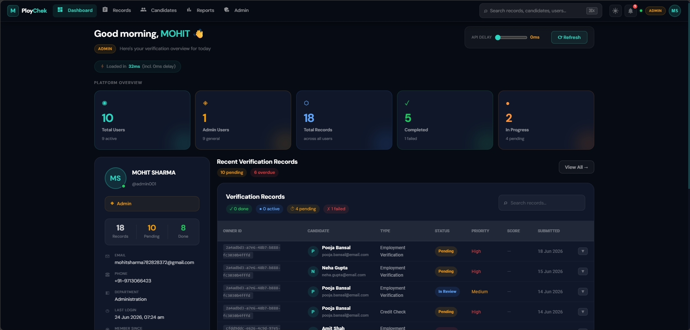
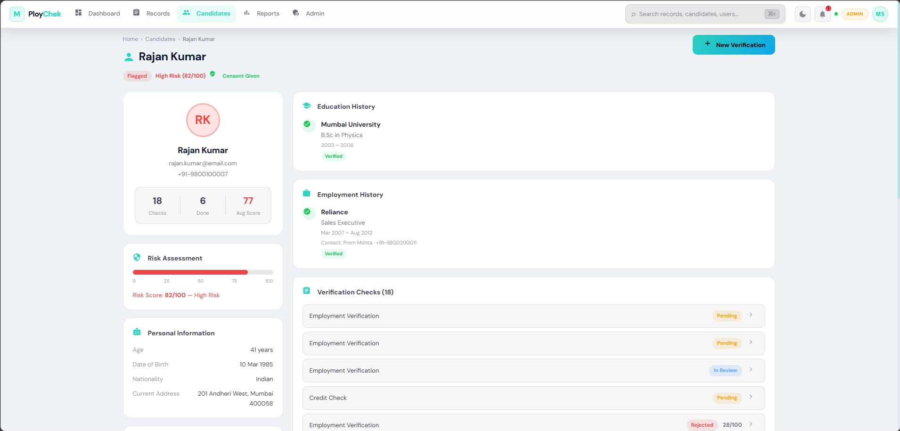
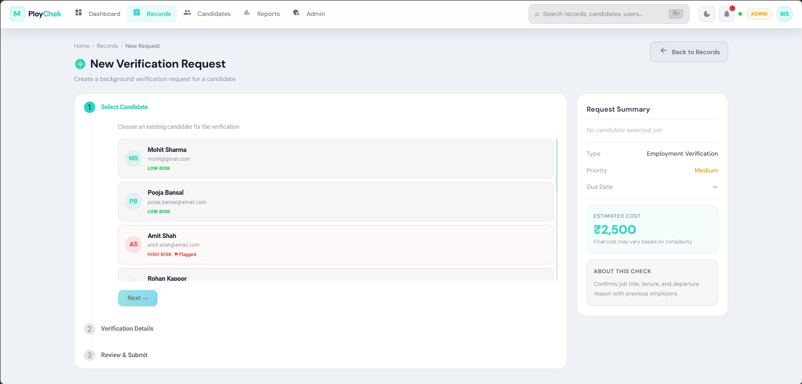
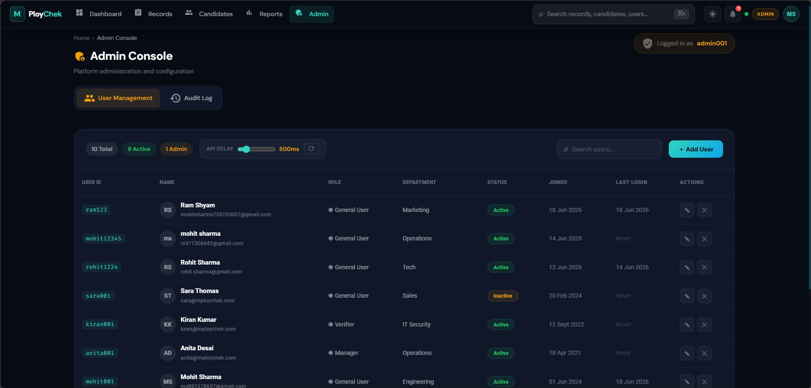
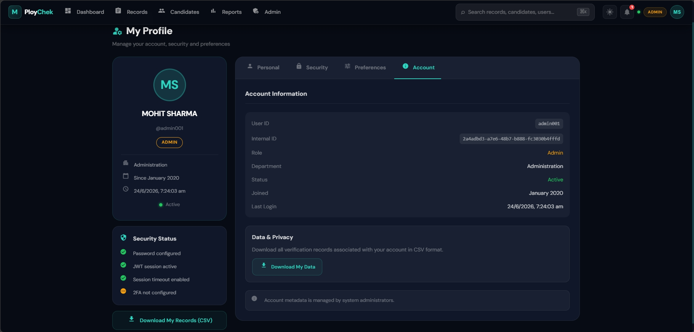
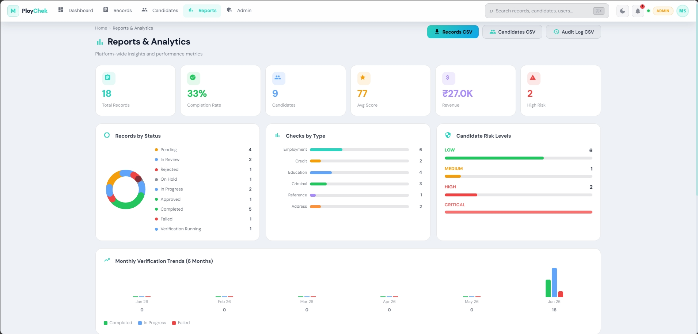
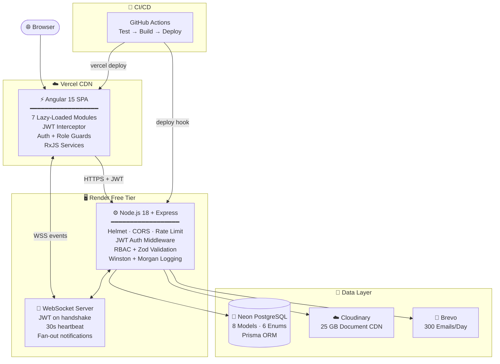
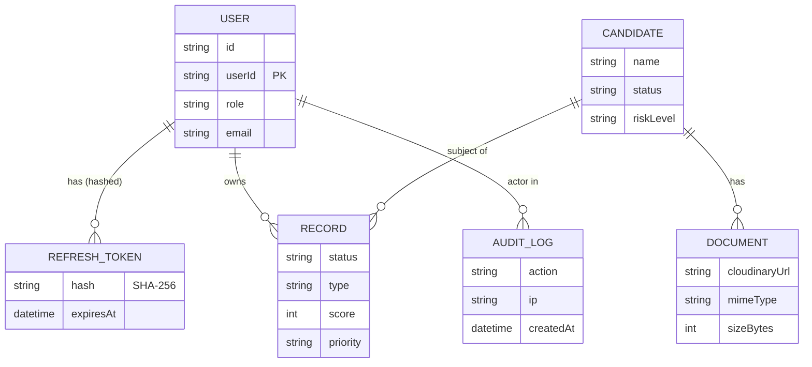
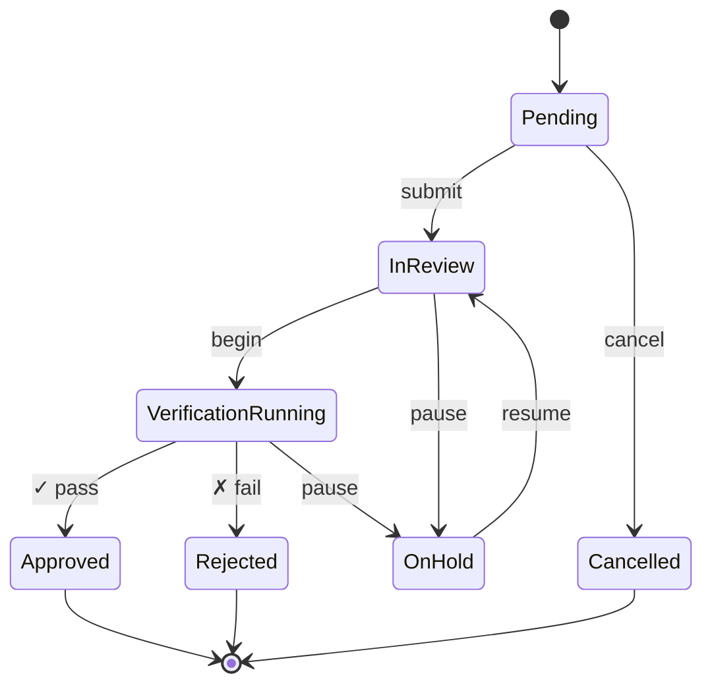
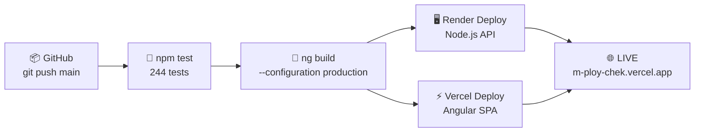

<div align="center">


[](https://m-ploy-chek.vercel.app)


<a href="https://m-ploy-chek.vercel.app">
  
</a>
&nbsp;
<a href="https://github.com/MsParadox/MPloyChek">
  
</a>
&nbsp;
<a href="https://github.com/MsParadox/MPloyChek">
  
</a>


<br/>


<br/>


</div>

<br/>


## &nbsp;🔍&nbsp; What Is MPloyChek?

MPloyChek is a **production-grade HR background verification SaaS** built to demonstrate every pattern that matters in a senior full-stack engineering role. It manages the complete lifecycle of candidate screening — criminal history, employment records, education verification, address validation — with an enforced state-machine workflow, real-time WebSocket notifications, an immutable audit trail, and fine-grained RBAC.

<table>
<tr>
<td>

> 💡 **Why build this?**
>
> Most portfolio projects stop at CRUD. MPloyChek demonstrates what production engineering actually looks like:
>
> - **Refresh token rotation** with SHA-256 hashed tokens stored server-side
> - **RBAC middleware** with 20+ granular permission constants enforced at the route boundary
> - **Zod validation** at every mutation — role never accepted from client
> - **WebSocket JWT auth** on handshake with heartbeat + dead connection cleanup
> - **State-machine workflow** — enforced transitions with terminal-state immutability
> - **244 automated tests** across 18 suites — repository pattern keeps each layer independently mockable

</td>
</tr>
</table>


<br/>


## &nbsp;🖥️&nbsp; Screenshots

<div align="center">

> **🔗 Try it live → [m-ploy-chek.vercel.app](https://m-ploy-chek.vercel.app)**

<table>

  <tr>
  <td align="center" width="50%">
      <strong>DASHBOARD</strong><br/>
            
    </td>
    <td align="center" width="50%">
      <strong>CANDIDATES SECTION</strong><br/>
      
    </td>
  
  </tr>
</table>


<table>
  <tr>
    <td align="center" width="50%">
      <strong>EMPLOYEE VERIFICATION</strong><br/>
            
    </td>
    <td align="center" width="50%">
      <strong>ADMIN PORTAL</strong><br/>
           
    </td>
  </tr>
</table>


<table>
  <tr>
    <td align="center" width="50%">
      <strong>MY PROFILE</strong><br/>
      
    </td>
    <td align="center" width="50%">
      <strong>REPORTS & ANALYTICS</strong><br/>
      
    </td>
  </tr>
</table>


</div>


<br/>

## &nbsp;✦&nbsp; Feature Overview

<div align="center">

<table>
<tr>
<td align="center" valign="top" width="33%">

### 🔐 Auth & Security

<kbd>JWT</kbd> <kbd>Refresh Tokens</kbd> <kbd>bcrypt</kbd>

Access tokens **8h** · Refresh tokens **7d**<br/>
SHA-256 hashed — raw token never stored<br/>
Rotation on every refresh (replay prevention)<br/>
bcrypt cost-factor **10** at service layer<br/>
Helmet headers on every response<br/>
Rate limiting: **10 login / 300 req** per IP/15 min<br/>

</td>
<td align="center" valign="top" width="33%">

### 🛡️ Authorization

<kbd>RBAC</kbd> <kbd>4 Roles</kbd> <kbd>Ownership</kbd>

`Admin` > `Manager` > `Verifier` > `General User`<br/>
**20+** granular permission constants<br/>
`requireRole([...])` enforced at route boundary<br/>
Ownership checks — General Users see own records only<br/>
Role set **server-side** on JWT issuance<br/>
Zod strips `role` from all client request bodies<br/>

</td>
<td align="center" valign="top" width="33%">

### ⚙️ Workflow Engine

<kbd>State Machine</kbd> <kbd>Transitions</kbd> <kbd>Immutable</kbd>

6 states with **enforced transitions**<br/>
Invalid move → `400` + `allowedNext[]` list<br/>
Terminal states **fully immutable** post-decision<br/>
Per-transition timeline event log<br/>
Priority, score, remarks per record<br/>
On-Hold / Resume loop supported<br/>

</td>
</tr>
<tr>
<td align="center" valign="top" width="33%">

### 📡 Real-Time (WebSocket)

<kbd>Native ws</kbd> <kbd>JWT Auth</kbd> <kbd>Heartbeat</kbd>

Native `ws` server — no Socket.io overhead<br/>
JWT verified **on handshake** (close `4401` = fail)<br/>
30s heartbeat — dead connections auto-terminated<br/>
**DB-first** — notification persisted before push<br/>
Decoupled `ws-notify.ts` (breaks circular imports)<br/>
Auto-reconnect (except auth failures)<br/>

</td>
<td align="center" valign="top" width="33%">

### 📊 Data & Analytics

<kbd>Search</kbd> <kbd>Export</kbd> <kbd>Audit Trail</kbd>

Cross-entity global search (users + candidates + records)<br/>
Cloudinary document CDN — PDF, JPEG, DOCX (10 MB)<br/>
CSV / JSON exports with RBAC-scoping<br/>
**Immutable audit log** — every action with actor + IP<br/>
Dashboard analytics: trends, risk, monthly charts<br/>
Pagination + sorting + filtering on all list endpoints<br/>

</td>
<td align="center" valign="top" width="33%">

### 🏗️ Engineering Quality

<kbd>244 Tests</kbd> <kbd>Repository Pattern</kbd> <kbd>Docker</kbd>

Repository pattern — routes/services/repos independently testable<br/>
Prisma schema-first + `DIRECT_URL` for migrations<br/>
7 **lazy-loaded** Angular modules (minimal bundle)<br/>
Docker multi-stage builds + Compose for local dev<br/>
Winston structured JSON + Morgan HTTP logging<br/>
GitHub Actions: test → type-check → build → deploy<br/>

</td>
</tr>
</table>

</div>


<br/>


## &nbsp;🎮&nbsp; Try It Live

<div align="center">

**🌐 [m-ploy-chek.vercel.app](https://m-ploy-chek.vercel.app)** — Login with any account below

<br/>

<table>
<tr>
<th>Role</th>
<th>User ID</th>
<th>Password</th>
<th>Access Level</th>
</tr>
<tr>
<td>🔴 <b>Admin</b></td>
<td><code>admin001</code></td>
<td><code>Admin@123</code></td>
<td>Full access — users, all records, audit logs, analytics, exports</td>
</tr>
<tr>
<td>🟠 <b>Manager</b></td>
<td><code>john001</code></td>
<td><code>User@123</code></td>
<td>All candidates + records, analytics — no user management</td>
</tr>
<tr>
<td>🟡 <b>Verifier</b></td>
<td><code>priya001</code></td>
<td><code>Verify@123</code></td>
<td>Record status updates — can advance the workflow</td>
</tr>
<tr>
<td>🟢 <b>User</b></td>
<td><code>mohit001</code></td>
<td><code>User@123</code></td>
<td>Own records only — read-only access</td>
</tr>
</table>

> ⚡ **First load note:** Backend runs on Render free tier — may take ~30s on first wake-up after idle. Subsequent requests are instant.

</div>


<br/>


## &nbsp;🏛️&nbsp; Architecture



### Request Lifecycle

```
  HTTP Request
  │
  ├── express-rate-limit     429 if threshold exceeded
  ├── helmet                 Security headers, removes X-Powered-By
  ├── cors                   Origin check vs ALLOWED_ORIGINS env
  ├── express.json()         Body parse — 50 KB limit
  ├── morgan / httpLogger    Log: method · path · status · ms
  ├── authenticate()         JWT verify → attach req.user {sub, role, email}
  ├── requireRole([...])     RBAC → 403 if role not in allowed list
  ├── validate(zodSchema)    Zod → 400 + field errors on failure
  └── Route Handler
        └── Service Layer    Business logic (pure TS — no HTTP, no Prisma)
              └── Repository Prisma queries → Neon PostgreSQL
                    └── { success, data, timestamp, processingTime }
```


<br/>


## &nbsp;🗄️&nbsp; Data Model &amp; Workflow

<table>
<tr>
<td valign="top" width="55%">

**8 Prisma Models**



</td>
<td valign="top" width="45%">

**Verification State Machine**



> Invalid transitions → `400`  
> + `allowedNext[]` in response  
> Terminal states reject all updates

</td>
</tr>
</table>


<br/>


## &nbsp;🔒&nbsp; Security Model

<div align="center">

| Layer | Mechanism | Detail |
|:------|:----------|:-------|
| 🪪 **Auth** | JWT + Refresh Token Rotation | 8h access · 7d refresh · SHA-256 hash stored · old token revoked on every refresh |
| 🛡️ **Authorization** | RBAC middleware | `requireRole([...])` at route boundary · 20+ permission constants · role never accepted from client |
| 🔑 **Passwords** | bcrypt (factor 10) | Hashed in service layer — repository only ever handles hashes |
| 📋 **Headers** | Helmet.js | CSP · X-Frame-Options · HSTS · removes X-Powered-By |
| ⏱️ **Rate Limiting** | express-rate-limit | 10 login / 300 general per IP / 15 min — brute-force prevention |
| ✅ **Input** | Zod schemas | Runtime validation before service layer · `role` stripped from all request bodies |
| 📝 **Audit** | Immutable log | Actor · action · target · IP · timestamp on every state change |
| 🔌 **WebSocket** | JWT on handshake | Token verified before WS registered · close code `4401` on auth failure |
| 🚫 **Ownership** | Runtime check | General Users cannot access other users' records even with valid JWT |

</div>


## &nbsp;🧰&nbsp; Tech Stack

<div align="center">

[](https://skillicons.dev)

</div>

<br/>

<table>
<tr>
<td valign="top" width="50%">

**⚙️ Backend**

| Layer | Technology | Why chosen |
|-------|-----------|------------|
| Runtime | Node.js 18 LTS | Non-blocking I/O, V8, broad ecosystem |
| Language | TypeScript 5 | End-to-end type safety; zero runtime drift |
| Framework | Express.js | Minimal, well-understood, trivial to test |
| ORM | Prisma 5 | Schema-first, type-safe queries, migrations as code |
| Database | PostgreSQL (Neon) | ACID, advanced indexing, free permanent tier |
| Auth | JWT + Refresh tokens | Stateless access + revocable sessions |
| Validation | Zod | Runtime-safe schema validation + TS inference |
| Security | Helmet + bcrypt + rate-limit | Production hardening out of the box |
| Logging | Winston + Morgan | Structured JSON, daily rotation, HTTP log |
| Real-time | ws (WebSocket) | Native, no dependency overhead |
| Email | Nodemailer + Brevo | 300 free emails/day, no card |
| Storage | Multer + Cloudinary | Zero-cost document CDN |

</td>
<td valign="top" width="50%">

**⚡ Frontend**

| Layer | Technology | Detail |
|-------|-----------|--------|
| Framework | Angular 15 | Full production SPA |
| Language | TypeScript | Fully typed across all layers |
| UI Library | Angular Material | Design system + accessibility |
| State | RxJS | BehaviorSubject, switchMap, takeUntil |
| HTTP | HttpClient + Interceptor | Auto-attach JWT, auto-refresh on 401 |
| Routing | Angular Router | 7 lazy-loaded feature modules |
| Charts | Chart.js | Analytics visualizations |

**☁️ Infrastructure (All Free)**

| Service | Purpose | Limit |
|---------|---------|-------|
| Vercel | Frontend CDN | Unlimited deploys |
| Render | Backend API | 750 hrs/month |
| Neon | PostgreSQL | 512 MB · 5 GB transfer |
| Cloudinary | Document storage | 25 GB |
| Brevo | Email | 300/day |
| GitHub Actions | CI/CD | 2 000 min/month |

</td>
</tr>
</table>


<br/>


## &nbsp;🚀&nbsp; Quick Start

> **Prerequisites:** Node.js 18+ and a free [Neon](https://neon.tech) database account (no card required)

```bash
# ── 1. Clone ─────────────────────────────────────────────────────
git clone https://github.com/MsParadox/MPloyChek.git
cd MPloyChek

# ── 2. Install ───────────────────────────────────────────────────
cd backend && npm install
cd ../frontend && npm install && cd ..

# ── 3. Configure ─────────────────────────────────────────────────
cd backend
cp ../.env.example .env
# Edit .env:
#   DATABASE_URL  = postgresql://... (from Neon dashboard)
#   DIRECT_URL    = postgresql://... (same — non-pooled for migrations)
#   JWT_SECRET    = $(openssl rand -hex 32)

# ── 4. Database setup ────────────────────────────────────────────
npx prisma migrate deploy    # runs all migrations
npx prisma db seed           # loads 4 demo users + sample data

# ── 5. Start ─────────────────────────────────────────────────────
npm run dev                  # terminal 1  →  http://localhost:3000
cd ../frontend && npm start  # terminal 2  →  http://localhost:4200
```

```bash
# ── Docker alternative (full stack, one command) ─────────────────
cp .env.example .env         # fill in DATABASE_URL + JWT_SECRET
docker-compose -f docker-compose.dev.yml up
```


<br/>


## &nbsp;🧪&nbsp; Test Suite — 244 Tests

<div align="center">

```
╔══════════════════════════════════════════════════════════════════╗
║                  244 TESTS  ·  18 SUITES                         ║
║          No live database required for unit + integration        ║
╠══════════════════════════════════════╦═══════════════════════════╣
║  Statements                          ║  █████████████████░░░  81%║
║  Branches                            ║  ██████████████░░░░░░  62%║
║  Functions                           ║  ████████████████░░░░  76%║
║  Lines                               ║  █████████████████░░░  84%║
╚══════════════════════════════════════╩═══════════════════════════╝
```

</div>

```bash
cd backend

npm test                   # full suite — run once, non-watch
npm run test:unit          # schemas · services · lib utilities
npm run test:flow          # auth lifecycle + state machine E2E
npm run test:coverage      # HTML report → open coverage/index.html
npm run test:ci            # CI mode — enforces all coverage gates

# Integration tests against real Neon branch (opt-in)
DATABASE_URL_TEST=<neon_url> npm run test:integration
```

<details>
<summary><b>📋 What's covered</b></summary>

<br/>

| Area | Tests | Key assertions |
|------|------:|----------------|
| Login flow | Auth routes + flow | Role from DB · audit log written · token pair returned |
| Refresh rotation | Auth routes | Old token revoked · new pair issued · original request retried |
| Password change | Routes + flow | All sessions revoked after change |
| RBAC on every route | Each route file | Wrong role → 403 · correct role → 2xx |
| Record state machine | Workflow test | All valid transitions pass · all invalid → 400 + `allowedNext` |
| Terminal immutability | Workflow test | APPROVED/REJECTED records reject all field updates |
| Zod schemas | schemas test | All schemas · edge cases · role-stripping invariant |
| Document authz | Documents test | Wrong-owner delete → 403 · Cloudinary + local paths |
| User management | users routes | Admin-only create · self-edit guard · ROLE_CHANGED audit |
| Search/Analytics/Export | Dedicated tests | Privilege scoping · RFC-4180 CSV · audit access |
| Email service | lib/email | SMTP-on / SMTP-off · EAUTH 525 handled gracefully |
| WebSocket bus | lib/ws-notify | Register · dedup-close · `notifyUser` fan-out |
| Frontend auth | auth.service.spec | Token storage · role helpers · logout clears state |
| Angular routing | auth.guard.spec | Unauthenticated → redirect to `/auth/login` |

</details>


<br/>

## &nbsp;📡&nbsp; API Reference

**Base URL:** `https://mploychek-api.onrender.com/api` &nbsp;·&nbsp; **Auth:** `Authorization: Bearer <accessToken>`

<details>
<summary><b>🔐 Auth</b> — login · refresh · logout · me · change-password</summary>

<br/>

| Method | Endpoint | Auth | Description |
|--------|----------|:----:|-------------|
| `POST` | `/auth/login` | ❌ | Returns access + refresh tokens + user object |
| `POST` | `/auth/refresh` | ❌ | Rotate token pair — old refresh revoked immediately |
| `POST` | `/auth/logout` | ✅ | Revoke all sessions for current user |
| `GET` | `/auth/me` | ✅ | Current user profile |
| `POST` | `/auth/change-password` | ✅ | Change password + revoke all sessions |

</details>

<details>
<summary><b>📋 Records</b> — verification request lifecycle</summary>

<br/>

| Method | Endpoint | Role | Description |
|--------|----------|------|-------------|
| `GET` | `/records` | All | List — Admin/Manager see all · others see own |
| `POST` | `/records` | Admin · Manager | Create verification request |
| `PATCH` | `/records/:id` | Admin · Manager · Verifier | Update status · score · remarks |
| `GET` | `/records/summary` | All | Status breakdown counts |
| `GET` | `/records/:id` | All | Record detail + full timeline |

</details>

<details>
<summary><b>👤 Users</b> — user management (Admin only)</summary>

<br/>

| Method | Endpoint | Description |
|--------|----------|-------------|
| `GET` | `/users` | List all users (paginated) |
| `GET` | `/users/stats` | Platform user statistics |
| `POST` | `/users` | Create user |
| `PATCH` | `/users/:id` | Update user (Admin or self) |
| `DELETE` | `/users/:id` | Delete user |

</details>

<details>
<summary><b>🧑 Candidates · 📁 Documents · 🔔 Notifications · 🔍 Search · 📤 Export</b></summary>

<br/>

| Method | Endpoint | Role | Description |
|--------|----------|------|-------------|
| `GET/POST/PATCH/DELETE` | `/candidates` | Varies | Candidate CRUD |
| `POST` | `/documents/upload/:id` | Admin · Manager · Verifier | Upload (multipart, max 10 MB) |
| `GET` | `/documents/candidate/:id` | All | List candidate documents |
| `DELETE` | `/documents/:id` | Admin or Owner | Delete document |
| `GET` | `/notifications` | All | User notifications |
| `PATCH` | `/notifications/mark-all-read` | All | Mark all read |
| `GET` | `/search?q=term` | All | Cross-entity global search |
| `GET` | `/export/records?format=csv\|json` | All (own) | Export records |
| `GET` | `/export/candidates?format=csv\|json` | Admin · Manager | Export candidates |
| `GET` | `/analytics/overview` | Admin · Manager · Verifier | Dashboard analytics |

</details>

**WebSocket:** `wss://mploychek-api.onrender.com?token=<JWT>`  
JWT verified on handshake · pushes `{ type, id, message, recordId }` · 30s heartbeat · close `4401` = auth failure


<br/>


## &nbsp;📁&nbsp; Project Structure

```
MPloyChek/
│
├── 📂 backend/
│   ├── prisma/
│   │   ├── schema.prisma          ← 8 models · 6 enums — single source of truth
│   │   └── seed.ts                ← seeds 4 demo users + sample candidates + records
│   └── src/
│       ├── index.ts               ← Express bootstrap · WebSocket server · route mounting
│       ├── lib/
│       │   ├── prisma.ts          ← PrismaClient singleton (prevents pool exhaustion)
│       │   ├── logger.ts          ← Winston: JSON prod / colored dev · daily rotation
│       │   ├── email.ts           ← Brevo SMTP · lazy transporter · graceful failure
│       │   ├── storage.ts         ← Cloudinary + local fallback · MIME + size limits
│       │   └── ws-notify.ts       ← WS client map + notifyUser() (decoupled from index)
│       ├── middleware/
│       │   ├── auth.ts            ← JWT verify → req.user {sub, role, email}
│       │   ├── rbac.ts            ← requireRole([]) · requireAdmin
│       │   └── validate.ts        ← Zod schema validator factory
│       ├── repositories/          ← ALL Prisma queries here, nowhere else
│       ├── services/              ← Business logic (pure TS · no HTTP · no Prisma)
│       └── routes/                ← 9 route groups at /api/<resource>
│
├── 📂 frontend/
│   └── src/app/
│       ├── core/
│       │   ├── services/          ← RxJS HTTP wrappers · auth · ws service
│       │   ├── models/            ← TypeScript interfaces (User, Record, Candidate…)
│       │   ├── guards/            ← AuthGuard · RoleGuard
│       │   └── interceptors/      ← JWT attach + auto-refresh on 401
│       ├── modules/               ← 7 lazy-loaded feature modules
│       │   ├── auth/              ← login form
│       │   ├── dashboard/         ← stats cards · recent records · flagged candidates
│       │   ├── candidates/        ← CRUD + document upload
│       │   ├── records/           ← CRUD + workflow status transitions
│       │   ├── admin/             ← user management (Admin only)
│       │   ├── notifications/     ← notification center + mark-read
│       │   └── profile/           ← account settings · password change
│       └── shared/                ← navbar · global-search · session-warning
│
├── 📂 docs/
│   ├── 01-architecture.md         ← system design · request lifecycle · key decisions
│   ├── 02-api-reference.md        ← full endpoint reference with examples
│   ├── 03-authentication.md       ← JWT + refresh token flow with sequence diagrams
│   ├── 04-rbac.md                 ← full permission matrix + code patterns
│   ├── 05-deployment.md           ← step-by-step zero-cost deployment guide
│   └── 06-testing.md              ← test commands · patterns · coverage breakdown
│
├── 📂 .github/workflows/          ← CI/CD: test → type-check → build → deploy
├── 🐳 docker-compose.dev.yml      ← local full-stack environment
├── 📄 render.yaml                 ← Render Blueprint one-click deploy config
└── 📖 README.md
```


<br/>


## &nbsp;☁️&nbsp; Deployment



<div align="center">

| [](https://vercel.com) | Angular 15 SPA | Unlimited deploys · 100 GB bandwidth |
|:---:|:---:|:---:|
| [](https://render.com) | Node.js / Express | 750 hrs/month |
| [](https://neon.tech) | Database | 512 MB · 5 GB transfer |
| [](https://cloudinary.com) | File storage | 25 GB |
| [](https://brevo.com) | Transactional email | 300/day |
| [](https://github.com/features/actions) | CI/CD pipeline | 2 000 min/month |


</div>

📖 Full step-by-step guide: [`docs/05-deployment.md`](./docs/05-deployment.md)


<br/>


## &nbsp;💼&nbsp; What Makes This Stand Out

<div align="center">

| Pattern | Where | What a recruiter/interviewer sees |
|:--------|:------|:----------------------------------|
| Refresh token rotation | `auth.service.ts` | Token is revoked on every use — demonstrates understanding of replay attacks |
| Repository pattern | `repositories/` | Decoupled data layer; route tests mock repos without touching the DB |
| State machine enforcement | `records.routes.ts` | Not just status string updates — invalid transitions are blocked with typed responses |
| WebSocket security | `index.ts` + `ws-notify.ts` | JWT on handshake, not userId string — close code 4401 on failure |
| Circular dependency fix | `ws-notify.ts` extraction | Understood Node.js module loading well enough to resolve a real cycle |
| DB-first notifications | `ws-notify.ts` + routes | Reliability over "fire and forget" — explains understanding of distributed systems |
| Zod + TypeScript inference | `schemas/index.ts` | Schema is the single source of truth for both runtime and type layer |
| Coverage-gated CI | `.github/workflows/` | Tests actually enforce quality — not just "we have tests" |

</div>


<br/>


<div align="center">


<br/>

**Mohit Sharma** — Full-Stack Developer · Angular · Node.js · TypeScript · PostgreSQL

<br/>

[](https://github.com/MsParadox)
[](https://www.linkedin.com/in/mohit-sharma-27a6532b6)
[](https://m-ploy-chek.vercel.app)
[](https://mohit-portfolio-bjd4.onrender.com)

<br/>

<sub>If this project helped you — a ⭐ star goes a long way 🙏</sub>

</div>
